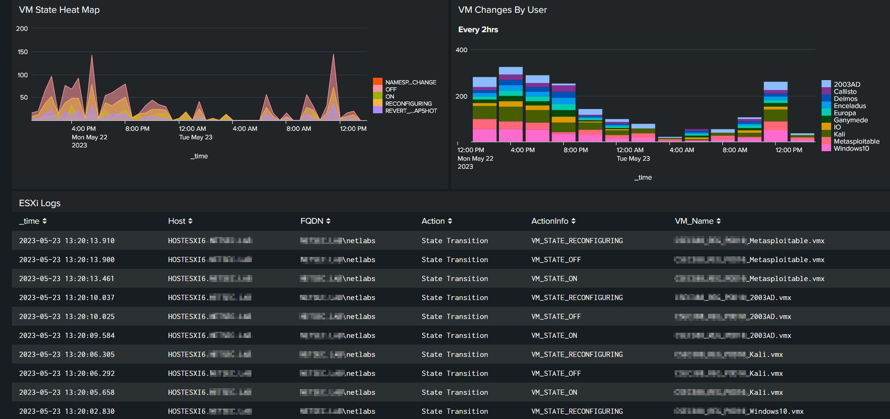

# Splunk Dashboards
> All dashboards use the `main` index to parse logs

## C2/Privesc Monitoring
> This is an experimental dashboard for catching potential C2 and priviledge escalation attempts. It currently looks at processes and dns logs. 
### Search Fields: 
- Search Timeframe
- Host
- Process
### Example Dashboard Activity:
  
  
  

## ESXi + vCenter Monitoring
> This dashboard detects potential hardware and virtual machine failures for ESXi servers, among user activity. 
### Search Fields: 
- Search Timeframe
- Host
- Username
- VM Name
### Example Dashboard Activity:
  
  
  

## Linux User Activity
> This dashboard investigates user account modifications, login attempts, running processes, file system modifications, and services on Linux servers and endpoints. 
### Search Fields:
- Search Timeframe
- Host
- User
### Example Dashboard Activity:
  
  
  
  

## Scanning/Brute-Force Detections
> This dashboard is for catching potential reconissance based on firewall and access logs.
### Search Fields:
- Search Timeframe
### Example Dashboard Activity:
  
  

## Service Monitoring
> This dashboard is for monitoring critical infrastructure including, email servers, web servers, remote access logs, database connections and dns logs. 
### Search Fields:
- Search Timeframe
- Host 
- User
### Example Dashboard Activity:

## Splunk Integrity Monitoring
> This dashboard parses default Splunk logs for login attempts, user account modifications, dashboard edits, top requested pages, and search activity.
### Search Fields:
- Search Timeframe
- User
### Example Dashboard Activity:
  
  
  

## User Activity Monitoring
> This dashboard monitors anomalous user activity on both Windows and UNIX OSes. It takes the top/most interesting fields from the Windows Activity and the Linux Activity Dashboards. 
 ### Search Fields: 
 - Search Timeframe
 - Target Host
 - Client IP
 - User Name
 ### Example Dashboard Activity:
  
  
  

## Web Activity Monitoring
> This dashboard looks for common SQLi, File Inclusion, and XSS attacks along with irregular web activity such as weird HTTP requests, possible web shells, and user agent strings. 
 ### Search Fields: 
 - Search Timeframe
 - Target Host
 - Client IP
 - HTTP Response Code
 ### Example Dashboard Activity:
  
  
  
  

## Windows Activity
> This dashboard investigates user account modifications, login attempts, running processes, file system modifications, and services on Windows servers and endpoints. 
### Search Fields
- Search Timeframe
- Source IP
- Target Host
- User
### Example Dashboard Activity:
