# Splunk Guide
> Note: prior to following this guide, install any Linux OS and assign a static ip address

## Installing Splunk Server
### Downloading Splunk
1. Download the package on any Linux VM
`cd /opt`
##### Debian-based
- 	`wget -O splunk.deb https://download.splunk.com/products/splunk/releases/9.0.1/linux/splunk-9.0.1-82c987350fde-linux-2.6-amd64.deb `
-	`dpkg -i splunk.deb`
##### RHEL-based
 -	`wget -O splunk.tgz https://download.splunk.com/products/splunk/releases/9.0.1/linux/splunk-9.0.1-82c987350fde-Linux-x86_64.tgz`
-	`tar -xvzf splunk.tgz`

### Starting the Installation
2. Install the server from the `/opt/splunk/bin/` folder:
 	`./splunk start --accept license`
 	`./splunk enable boot-start`

3. After the installation completes, navigate to the web interface IP & Login with the credentials 
 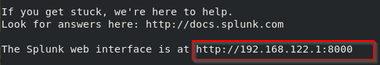

## Installing Apps
> Note: these are some useful applications and add-ons i enjoy using

### Table of Apps 
| App                                   | Link										| Sourcetype/Index  |
| :----------------------------------- 	| :---------------------------------------  | :---------------	|
| Sysmon								| https://splunkbase.splunk.com/app/1914/ 	| xmlwineventlog	|
| Alert Manager							| https://splunkbase.splunk.com/app/2665 	| 					|
| Enterprise Security (restricted☹) 	| https://splunkbase.splunk.com/app/263 	| 					|
| MITRE ATT&CK							| https://splunkbase.splunk.com/app/4617 	| 					|
| CIM									| https://splunkbase.splunk.com/app/1621 	| 					|
| Sankey Diagrams for MITRE 			| https://splunkbase.splunk.com/app/3112 	| 					|
| Palo Alto Add-on						| https://splunkbase.splunk.com/app/2757 	| 					|
| Palo Alto App 						| https://splunkbase.splunk.com/app/491 	| 					|
| pfSense add-ons						| https://splunkbase.splunk.com/app/1527 	| 					|
| Website Monitoring 					| https://splunkbase.splunk.com/app/1493 	| 					|
| Pstree								| https://splunkbase.splunk.com/app/5721 	| N/A 				|
| *Requirement for pstree pip3 install splunk-dev*  								| 					|

### Instructions for Installation
1. Download whatever apps you want
2. Go to `Search & Reporting > Apps > Manage Apps`
 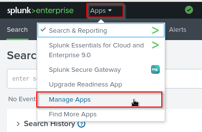
3. Select "Install app from file"
 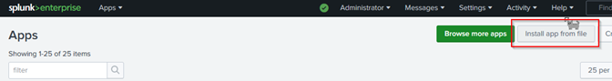
4. Upload the app by clicking browse, selecting your file, then clicking upload
 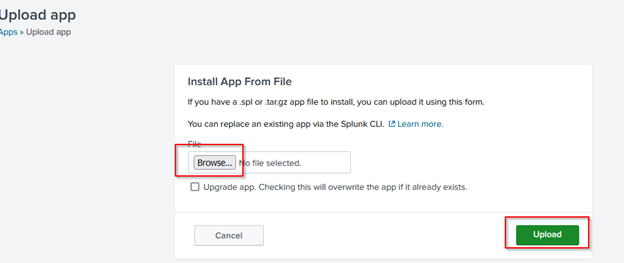 

## Configuring Receiving for Universal Forwarders and Syslog
1. Login to the Management UI – [https://xxxxx:8000](https://xxxxx:8000)

### Syslog Receiving – 
> Used for networking devices, like Cisco Routers, Switches, PA-VMs, etc.

2. Navigate to `Settings > Data inputs`
 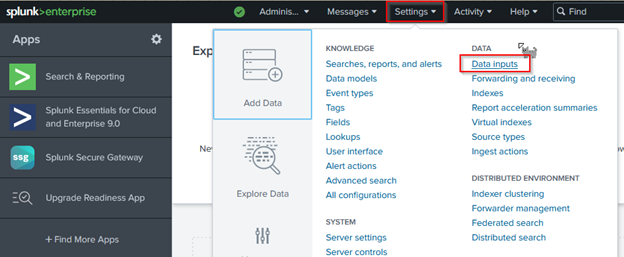
3. Find the UDP Local Input Type and Click ‘Add new’
 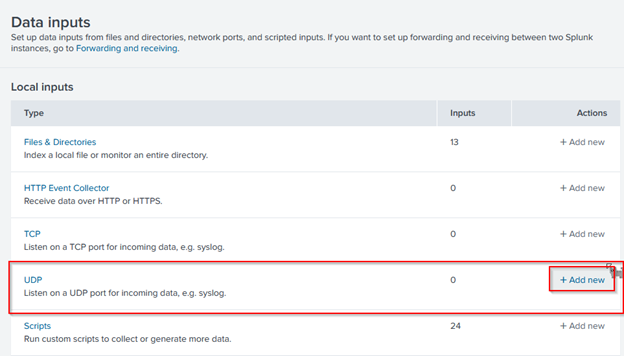
4. Under Port, type 514, then click next
 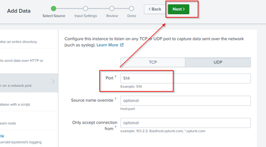
5. On the next page, select the source type of “syslog”, you may have to search & scroll down for it. Then under index, create a new index for these logs. Name it syslog & leave everything else default
 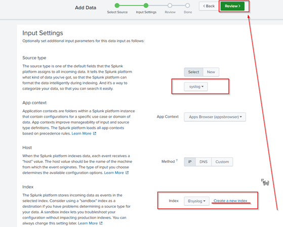
6. On the review page, click Submit to finish adding the log input

### Universal Forwarder Receiving -
1. Go to `Settings > Forwarding and Receiving`
 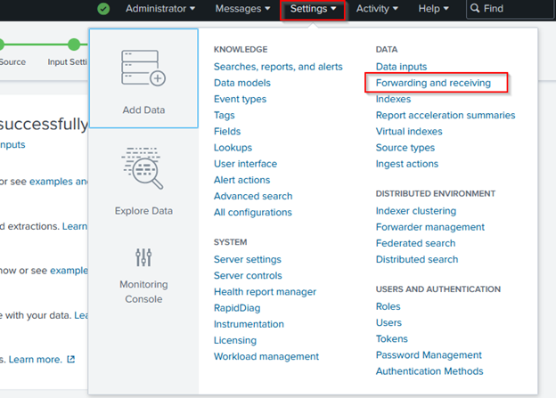
2. Under `Receive data > Configure Receiving`, click Add new
 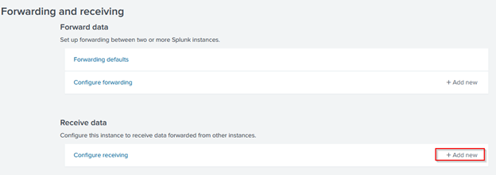
3. On the next page, type 9997 for “Listen on this port”, then click Save
  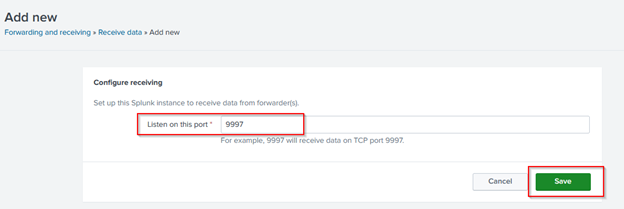

## Setup Forwarder Monitoring
1. To verify your inputs, go to `Settings > Monitoring Console`
 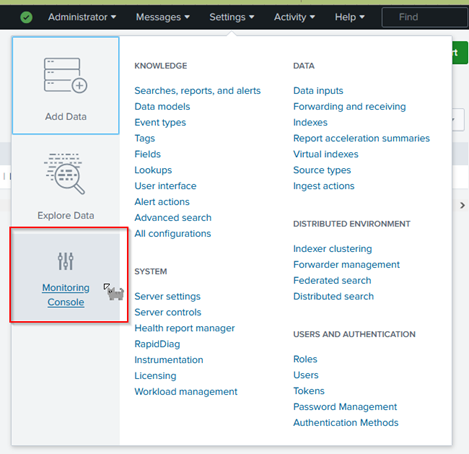
2. Then navigate to `Forwarders > Forwarders Instance`
 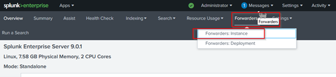
3. You will have to enable Forwarder Monitoring before you can see anything, so on this page, click the setup link
 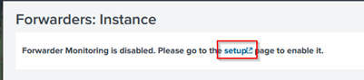
4. Click Enable under Forwarder Monitoring and then Save
 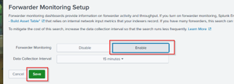
5. If you at any point fuck up your forwarders, change a hostname, etc. You can go back to this page and “Rebuild forwarder assets” 
 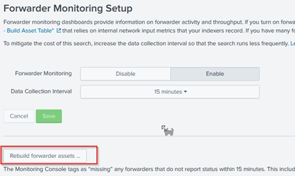
6. Go back to `Forwarders > Forwarders: Instance`. And you will see within 15minutes, all of the configured forwarders 😊

## Creating Windows & Linux Indexes
> Add two new indexes: **linux** and **windows** so you can parse through logs easier

1. Go to `Settings > Indexes`
 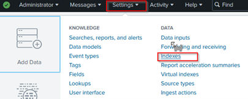
2. New Index
 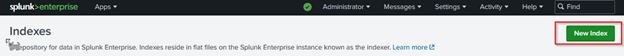
3. Set the following parameters for both the linux and windows index
 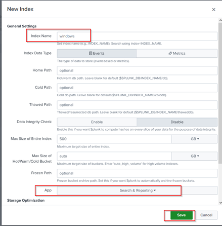
4. Set up forwarders w the following command: `./splunk add monitor / -index linux`
